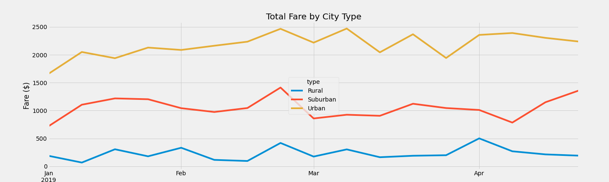

# chapter-5-challenge

## Challenge Overview
In this challenge, we will be using Pandas and Matplotlib to create a multiple-line graph that shows the total weekly fares for each city type. Finally, we’ll have written summary on how the data differs by city type and how those differences can be used by decision-makers at PyBer.

## Resources
- Data source: city_data.csv.csv, ride_data.csv
- Software/Libraries: Python 3.7.9, Jupyter Notebook, Anaconda, Pandas, Matplotlib

## Challenge Results

From the chart above, we can point out the following differences between each city types:
- Urban fares are highest follows by Suburban fares and finally Rural fares
- Fares drop significantly for Urban and Suburban area in May
- Fare peaks around the third week of February for all areas

## Challenge Summary
From the challenge result, I would recommend the CEO the following strategies:
1. The company should raise the fares in May to boost fares for this month since ride demand are lower in this month.
2. The company should raise the fare in the Rural area to compensate for the differences which is likely due to having less rides in this area.
3. The company should run more advertising and promotional campaigns from Feb through April since there are high demands for rides during this period.